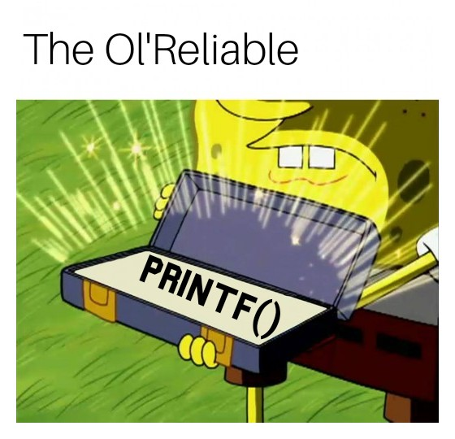

# Custom Printf Project



## Table of Contents

1. [Introduction](#introduction)
2. [Project Overview](#project-overview)
3. [Project Background](#project-background)
4. [Prerequisites](#prerequisites)
5. [How to Run the Code](#how-to-run-the-code)
6. [Tasks](#tasks)
   - [Task 0: Basic Printf Function](#task-0-basic-printf-function)
   - [Task 1: Handling `d` and `i` Specifiers](#task-1-handling-d-and-i-specifiers)
   - [Task 2: Custom `b` Specifier](#task-2-custom-b-specifier)
   - [Task 3: Additional Conversion Specifiers](#task-3-additional-conversion-specifiers)
   - [Task 4: Local Buffer](#task-4-local-buffer)
   - [Task 5: Custom `S` Specifier](#task-5-custom-s-specifier)
   - [Task 6: Custom `p` Specifier](#task-6-custom-p-specifier)
   - [Task 7: Flag Characters](#task-7-flag-characters)
   - [Task 8: Length Modifiers](#task-8-length-modifiers)
   - [Task 9: Field Width](#task-9-field-width)
   - [Task 10: Precision](#task-10-precision)
   - [Task 11: Zero Flag Character](#task-11-zero-flag-character)
   - [Task 12: Minus Flag Character](#task-12-minus-flag-character)
   - [Task 13: Custom `r` Specifier](#task-13-custom-r-specifier)
   - [Task 14: Custom `R` Specifier](#task-14-custom-r-specifier)
7. [How It Differs from the Built-in Printf](#how-it-differs-from-the-built-in-printf)
8. [Author](#author)

## Introduction

This project involves the creation of a custom `printf` function in C. The custom `printf` function is designed to replicate some of the functionality of the standard C `printf` function, allowing for the formatting and printing of text with various conversion specifiers and options.

## Project Overview

The project consists of implementing a custom `printf` function with support for different conversion specifiers, flag characters, length modifiers, and custom specifiers. It aims to provide a comprehensive and flexible printf-like functionality.

## Project Background

This project marks an important milestone in my learning journey as it is the first group project I have undertaken as part of the ALX Software Engineering Program. It signifies my progress and collaboration with my fellow learners in a real-world programming task.

## Prerequisites

Before using the code, ensure you have the following prerequisites:

- A C development environment (e.g., GCC compiler)
- Knowledge of C programming
- A text editor or Integrated Development Environment (IDE)

## How to Run the Code

To run the code, follow these steps:

1. Clone the project repository from [GitHub: printf](https://github.com/m-aishah/printf.git).
2. Navigate to the project directory.
3. Compile the code using the provided compilation command:

```bash
$ gcc -Wall -Werror -Wextra -pedantic -std=gnu89 *.c
```

4. Execute the resulting binary file.

## Tasks

The project is divided into multiple tasks, each adding specific features to the custom `printf` function. Here's an overview of each task:

### Task 0: Basic Printf Function

- Implement a basic `_printf` function that handles `%c`, `%s`, and `%%` conversion specifiers.

### Task 1: Handling 'd' and 'i' Specifiers

- Extend the `_printf` function to handle `%d` and `%i` conversion specifiers.

### Task 2: Custom 'b' Specifier

- Implement a custom `%b` specifier to convert an unsigned int argument to binary.

### Task 3: Additional Conversion Specifiers

- Extend `_printf` to handle `%u`, `%o`, `%x`, and `%X` conversion specifiers.

### Task 4: Local Buffer

- Use a local buffer of 1024 characters to minimize calls to the `write` function.

### Task 5: Custom 'S' Specifier

- Implement a custom `%S` specifier to print strings with non-printable characters represented as '\x' followed by the ASCII code value in hexadecimal.

### Task 6: Custom 'p' Specifier

- Handle the `%p` specifier for printing memory addresses.

### Task 7: Flag Characters

- Handle the '+', space, and `#` flag characters for non-custom conversion specifiers.

### Task 8: Length Modifiers

- Handle the 'l' and 'h' length modifiers for conversion specifiers `%d`, `%i`, `%u`, `%o`, `%x`, and `%X`.

### Task 9: Field Width

- Handle field width for non-custom conversion specifiers.

### Task 10: Precision

- Handle precision for non-custom conversion specifiers.

### Task 11: Zero Flag Character

- Handle the '0' flag character for non-custom conversion specifiers.

### Task 12: Minus Flag Character

- Handle the '-' flag character for non-custom conversion specifiers.

### Task 13: Custom 'r' Specifier

- Implement a custom `%r` specifier that prints the reversed string.

### Task 14: Custom 'R' Specifier

- Implement a custom `%R` specifier that prints the ROT13'ed string.

## How It Differs from the Built-in Printf

This custom `printf` implementation replicates some of the functionality of the standard C `printf` function, allowing for formatted text output with various conversion specifiers. However, it is customized to meet specific project requirements and includes additional custom specifiers and features.

## Author

- **Author**: Aishah Ayomide Mabayoje
- **Email**: maishah2540@gmail.com

---
